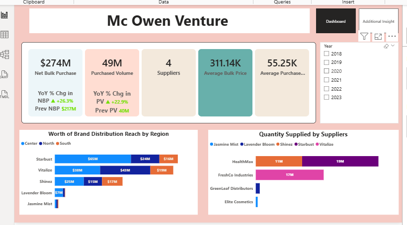
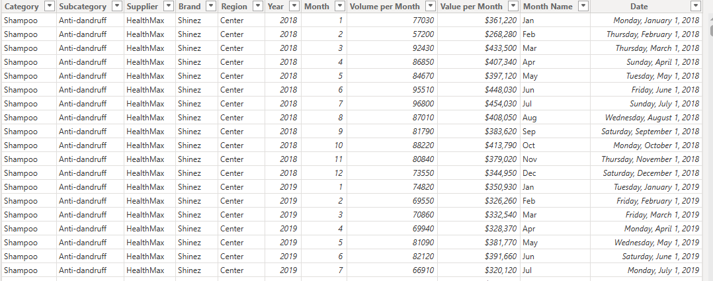

# Mc Owen Venture’s Report
This analysis objective is to show the role played by major suppliers in achieving the purchase for the period under review and the level of distribution reach attained which consequentially have its effects on the total sales  by the business.

## Executive Summary
- Management requires a comprehensive view of overall business performance, spanning the total cost of goods purchased from manufacturers, the distribution of these goods across all channels, and the impact of brand performance on sales across all business units.
- Developed an interactive power BI which addresses the major concerns of the management to create different KPI cards  and provide other visuals to break down other findings  using the available dataset which contains over 800 rows and 11 columns.
- Delivered a centralized, data-driven reporting solution which shows that the business has purchased over $270M worth of goods from the manufacturers which is 26.3% higher than that of the previous year and so much more .
## The Business Problem
Mc Owen requires a robust, data-driven solution to holistically evaluate business performance across the value chain—covering total purchases, distribution efficiency, and brand sales performance, while analyzing consumer response to brands over time.
### Key Questions Addressed:
- How have Key Performance Indicators (KPIs) changed YoY?
- Which product categories and regions are lagging?
- Which brand is the most supplied by the manufacturer?
## The Process (Methodology)
### Tools Used:
Power BI, Power Query, DAX
### Data Sourcing & Overview
The dataset consists of approximately 880 transactions with 11 columns, covering operations across all current regions
### Data Cleaning & Transformation (ETL)
Using Power Query, the raw data was transformed to ensure accuracy:
- Removed duplicate entries from the dataset.
- Created a date table
- Removed all the nulls

## Analysis & Insights
This section breaks down the data into actionable stories.
### Breakdown of Net Bulk Purchase
- Net bulk purchases increased year-over-year to exceed $270M, representing a 26.3% growth. However, between 2018 and 2019, the business experienced a supply shortfall from manufacturers, which resulted in a $52M reduction in purchases, equivalent to a 4.4% decline.
- However, between 2020 and 2023, purchases rebounded and recorded consistent year-on-year growth, increasing from 0.7% in 2020 to a peak of 24.6% in 2023.
- Purchased volume shows an inverse relationship with Net Bulk Purchases, with a significant and sustained decline in volume over the period under review. While the available data does not provide sufficient detail to directly identify the underlying causes, a plausible contributing factor may be inflationary pressures, which eroded currency value in the international market and increased procurement costs.
- During the period under review the business has maintained only four manufacturers which ensure supply of different brands to all the locations of Mc Owen ventures.
## Analysis of Brand Distribution
Starbust leads overall distribution reach, with total goods valued at $105M, driven primarily by the Center region ($65M), followed by the Northern ($24M) and Southern ($16M) regions. Vitalize ranks second with a total distribution value of $100M, showing strong penetration in the Northern region ($43M), alongside the Center ($38M) and Southern ($19M). Shinez places third, with total distributions amounting to $57M, fairly balanced across the Center ($25M), Northern ($15M), and Southern ($17M) regions.
## Breakdown of Supply by Manufacturer
- The supply base shows high concentration risk, with HealthMax and FreshCo Industries contributing over 70% of total supply volume across all business units. This level of dependency increases exposure to potential supply disruptions, pricing pressures, and negotiation leverage from key suppliers.
- While HealthMax (30M units) and FreshCo Industries (17M units) provide scale and consistency, the heavy reliance on these two suppliers highlights the need to diversify the supplier base to improve supply resilience, reduce risk, and strengthen cost competitiveness.
## Breakdown of Value of Brand by Subcategories
- StarBust’s Volumizing subcategory leads supply value at over $104M, followed closely by Vitalize’s Color-Safe ($100M), highlighting strong concentration in top brand–subcategory combinations.
- The supply mix is dominated by a few high-value brand–subcategory combinations, led by StarBust (Volumizing) and Vitalize (Color-Safe). This concentration suggests strong demand alignment but also presents an opportunity to optimize inventory planning, negotiate better supplier terms, and assess growth potential in lower-performing subcategories.
## Breakdown of Cost of Goods Supplied by Region
Regional distribution is led by the Center ($136M), followed by the Northern ($85M) and Southern ($53M) regions.
## Recommendations
### Distribution & Regional Insights
- Optimize regional allocation:  The Center region dominates distribution ($136M), while the Southern region lags ($53M). Consider boosting Southern region supply to meet potential untapped demand.
- Monitor regional performance: Align distribution with sales trends to ensure inventory efficiency and reduce overstock in higher-supplied regions.
### Brand & Subcategory Performance
- Focus on top-performing subcategories: StarBust’s Volumizing ($104M) and Vitalize’s Color-Safe ($100M) dominate supply. Ensure stock levels and marketing efforts support continued growth.
- Evaluate growth opportunities for weaker subcategories:  Anti-Dandruff (Shinez) ranks third but may benefit from targeted promotions or distribution expansion.
## Links
[Interactive Power BI Link](https://app.powerbi.com/view?r=eyJrIjoiM2IzZDEzNWItNjc0MC00MjhmLTgwZmUtNDMyNWNhNTA0YTZmIiwidCI6IjY0M2NkODIwLWU2YzYtNGI2ZC05ZDc5LTJjOTgwOTllMTg3MCJ9)
